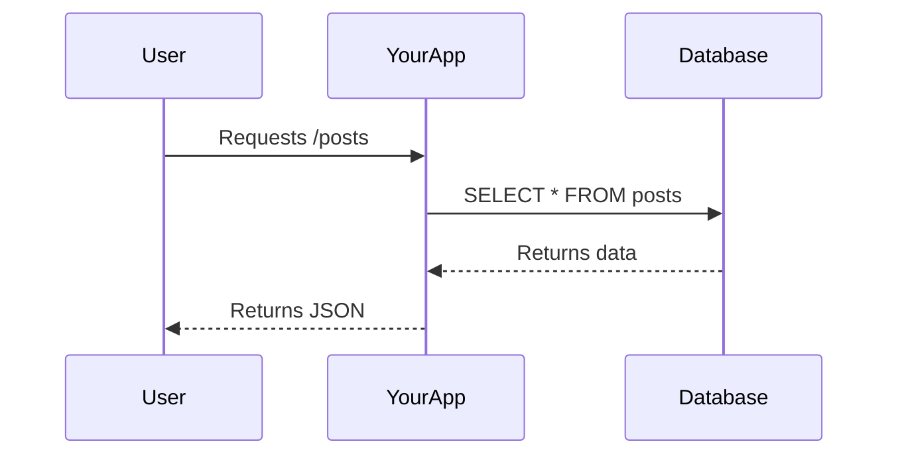

A complete Markdown guide, rewritten so each element uses a concrete, real-world tech scenario and a simple explanation designed to stick in your memory.

---

Complete Markdown Syntax: Real-World Tech Examples

1. Headings

```markdown
# My Project Docs
## Installation
### macOS Steps
```

Real-world tech use: You're writing a README for your app on GitHub.

Why it sticks: Think of headings as the folder structure of your document. # is the project name, ## are the main folders, ### are the subfolders. Just like you can't have two folders with the exact same name at the same level, headings give your docs a logical, navigable hierarchy.

---

2. Paragraphs and Line Breaks

```markdown
This is a new paragraph about the API's rate limit.
(A line break forces this sentence onto a new line, but it's still part of the same "thought.")
```

Real-world tech use: You're writing release notes. You want to list a change and then a minor note directly under it, without the big space of a new paragraph.

Why it sticks: A blank line is like hitting "Enter" twice in a word processor—it's a whole new thought. Two spaces and an "Enter" is like "Shift+Enter" in Slack—a new line, but still in the same message bubble.

---

3. Text Emphasis (Inline)

```markdown
The command is `git push`, and you **must** use the `--force` flag carefully. The old server name is *deprecated*.
```

Real-world tech use: You're writing a critical warning in a deployment guide.

Why it sticks: Bold is for danger or strong warnings (like a red flashing light), and italic is for terms that are new or "retired" (like a quiet, "by the way" note). Bold screams, italic whispers.

---

4. Strikethrough

```markdown
The login endpoint is now at `/api/v2/auth/login`. Use this, ~~not the old `/api/v1/login`~~.
```

Real-world tech use: You've just updated your company's internal API documentation after a major version change.

Why it sticks: It's the "crossed-out dead link" of text. You show the correct, live path forward while keeping a visible grave marker for the old way, so people who remember the old command know it's officially buried and gone.

---

5. Highlight / Mark (Common Extension)

```markdown
To fix the bug, change the value from `false` to ==true== on line 42 of `config.js`.
```

Real-world tech use: You're giving a code review comment on a Pull Request in a tool like BitBucket or a static site generator.

Why it sticks: It's your digital highlighter pen. You’re literally circling the one key change needed on a printout of code. It says, "Don't scan the whole file; your eyes need to come right here."

---

6. Subscript and Superscript (Extensions)

```markdown
Our O(n^2^) algorithm was replaced by one with O(n log n) performance. We also reduced CO~2~ emissions.
```

Real-world tech use: You're writing a blog post about a major performance breakthrough you achieved.

Why it sticks: Superscript is the exponent (the "raised to the power of" thing, always floating up), and subscript is the atom count in a molecule (always a small number hanging low, like a footnote).

---

7. Blockquotes

```markdown
> **Warning:** The production database will be in read-only mode during the migration, starting at 03:00 UTC.
```

Real-world tech use: You're sending out a team-wide email via a Markdown-based platform (like a HedgeDoc document) about scheduled maintenance.

Why it sticks: It's the "forwarded email" look. Every email client shows the original message indented with a colored line on the left. Use it whenever you're quoting a system alert or passing on an important message from above.

---

8. Unordered Lists

```markdown
- `nginx`
- `postgresql`
- `redis`
- `app-server`
- Instance 1
- Instance 2
```

Real-world tech use: You're listing the packages your automated setup script installed, or the services in your Docker Compose stack.

Why it sticks: It's your grocery list of services. The bullet is a checkbox on a clipboard. Items have no particular order—you just need to grab them all to make the system work. Indented items are the specific "flavors" of that service.

---

9. Ordered Lists

```markdown
1. Pull the latest image: `docker pull myapp:latest`
2. Stop the running container: `docker stop myapp`
3. Start the new container: `docker run -d myapp:latest`
```

Real-world tech use: You're writing a "Quick Deploy" runbook for your team.

Why it sticks: This is a recipe or an IKEA manual. You absolutely must follow the steps in this exact order, or you'll end up with a half-built, broken mess. Step 1 before Step 2, no exceptions.

---

10. Task Lists (GitHub-Flavored)

```markdown
## Deployment Checklist
- [x] Merge PR #254
- [x] Create git tag `v1.4.0`
- [ ] CI/CD build is green
- [ ] Notify #ops on Slack
```

Real-world tech use: The body of a GitHub Issue or Merge Request that acts as your go-live checklist.

Why it sticks: It’s a literal, clickable pre-flight checklist for a pilot. You don't just read it; you tick the boxes as you do them. The visual of checked vs. unchecked instantly shows mission readiness.

---

11. Code (Inline)

```markdown
Set the environment variable `NODE_ENV` to `production`.
```

Real-world tech use: You're explaining a configuration step in a tutorial or issue comment.

Why it sticks: Backticks are the "tech force field" around a term. They say, "This isn't just a word; it's a live wire, a piece of code." A variable name, a terminal command, a file path—if a computer reads it literally, trap it in backticks.

---

12. Code Blocks (Fenced)

```markdown
Here's a minimal `Dockerfile`:

```dockerfile
FROM node:18-alpine
WORKDIR /app
COPY package*.json ./
RUN npm ci --only=production
COPY . .
CMD ["node", "server.js"]
```
```

Real-world tech use: The main part of your project's README.md or a tutorial page on Dev.to.

Why it sticks: This is giving the user a fully contained, copy-pasteable file. The triple backticks are the cardboard box, the language tag (dockerfile) is the label on the box, and the content is the perfectly preserved code inside, with syntax colors to guide the eye.

---

13. Indented Code Blocks

```markdown
# This is a comment in a config file
server {
listen 80;
server_name localhost;
}
```

Real-world tech use: You're replying to a forum post and pasting a small snippet in the middle of your sentence, where setting up a fenced block is too much hassle.

Why it sticks: It's the classic typewriter way of showing code. You just hit the "Tab" key four times. It’s a quick and dirty "block quote" for code, preserved perfectly but with no fancy labels or colors—like plain-text email from the '90s.

---

14. Horizontal Rules

```markdown
## Bug Report

Describe the issue...

---

## Feature Request

Describe the solution...
```

Real-world tech use: You’re designing a GitHub Issue template with clearly separated sections.

Why it sticks: It's the "page break" of the web. It’s a visual slash through the page that says, "One major topic has definitively ended, and a completely different one now begins." It's a mental reset line.

---

15. Links (Inline)

```markdown
For more information, see the [Official React Docs](https://react.dev).
```

Real-world tech use: Standard way to reference documentation in any tutorial or README.

Why it sticks: It's a portal gun. The square brackets [] are the door frame you see, and the parentheses () are the hidden coordinates you program into the gun. You look at the text, click it, and are instantly teleported to the destination URL.

---

16. Links (Reference-Style)

```markdown
You should definitely check out the [Go documentation][go-docs] for this.

... (much later in the document) ...

[go-docs]: https://go.dev/doc/ "Go Official Documentation"
```

Real-world tech use: You’re writing a massive architectural decision record (ADR) and you reference the same RFC or tool’s website a dozen times.

Why it sticks: It’s a variable for a URL. You declare the long, ugly URL once at the bottom like a variable declaration, and then just use its clean, short label everywhere else. It keeps your source text as readable as a clean codebase.

---

17. Images (Inline)

```markdown

```

Real-world tech use: You're embedding a system architecture diagram into a design doc.

Why it sticks: It's an instant Polaroid picture in your document. The ! is the flash going off, [Alt text] is the caption written on the back for those who can't see the photo, and (URL) is the location where the photo is stored.

---

18. Images (Reference-Style)

```markdown
![Screenshot of the bug][bug-screenshot]

[bug-screenshot]: https://i.imgur.com/error.png "Login 500 Error"
```

Real-world tech use: A bug report where you want to keep the issue text readable but include a crucial screenshot.

Why it sticks: Just like the URL variable, this is a variable for your photo. You don't want the messy URL of the screenshot to break the flow of your bug report. Define it out of the way, and use the clean handle in the text.

---

19. Images with Links (Combined)

```markdown
[](https://travis-ci.com/user/repo)
```

Real-world tech use: The classic "build passing" badge at the top of almost every open-source README.md.

Why it sticks: This is a clickable button made of a picture. The badge image shows the status at a glance. The outer link turns the entire badge into a single big button that, when clicked, takes you to the detailed build logs. It’s a status icon that also works as a "door" to more info.

---

20. Tables (GitHub-Flavored)

```markdown
| Environment Variable | Type | Required? |
|----------------------|:-------------:|----------:|
| `DATABASE_URL` | String | Yes |
| `PORT` | Number | No |
| `LOG_LEVEL` | `debug` (str) | No |
```

Real-world tech use: Documenting all configuration options for your app's .env file.

Why it sticks: It’s your spreadsheet or database table view. Headers are column names. The colons in the separator line (:---:) are the "align text left/center/right" buttons you click in Excel. It turns a flat list into a structured, query-able-looking reference.

---

21. Escaping Characters (Backslash)

```markdown
A valid variable name in Bash might be \`my_var\`. The command is \`echo \*\` and not just \*.
```

Real-world tech use: Writing a guide about Bash scripting or regular expressions, where backticks or asterisks are the subject, not formatting.

Why it sticks: The backslash \ is the "cancel button" for formatting. Markdown is a hungry beast that wants to turn your * into italics. Putting \ right before it is like holding up a cross to a vampire—it neutralizes the magic power of that character, just for that one instance.

---

22. Inline HTML

```markdown
The message is <strong>bold</strong> and <em>italic</em>.

<details>
<summary>Click to see the full stack trace</summary>

```

Error: File not found
at Object.<anonymous> (/app/server.js:22:15)

```
</details>
```

Real-world tech use: Adding a collapsible section in a GitHub issue to hide a messy, 200-line long error log that would otherwise clutter the whole page.

Why it sticks: This is your "break glass in case of emergency" power button. When Markdown isn't powerful enough for a layout trick (like hiding content behind a click), you bypass it completely and speak directly to the web browser using HTML. The <details> tag creates a secret drawer that only opens on command.

---

23. Footnotes (Extension)

```markdown
This function has O(n) space complexity[^1], which was acceptable for our dataset size.

[^1]: Achieved by using an in-place algorithm, avoiding the creation of a new array.
```

Real-world tech use: A detailed technical blog post where you want to add a deep-dive explanation without derailing the main narrative for expert readers who already know it.

Why it sticks: It's the "fine print" or a Wikipedia citation. It lets you keep the main argument on a high, smooth road. The nerdy, granular detail is safely tucked away at the bottom of the page, linked by a tiny number hook that the curious reader can choose to follow.

---

24. Definition Lists (Extension)

```markdown
**Idempotency**
: An API property where making the same request multiple times produces the same result as making it once. `PUT` requests should be idempotent.

**Cache Invalidation**
: The process of clearing the stored cache when the underlying data changes. One of the "two hard things in CS."
```

Real-world tech use: Creating a glossary section at the end of your API design guide.

Why it sticks: This is a dictionary entry, pure and simple. The term is the word you're looking up, and the indented : is the definition that follows. It visually separates a subject from its meaning, perfect for explaining a jargon-heavy domain to a newcomer.

---

25. Heading IDs (Extension)

```markdown
## Frequently Asked Questions {#faq}
```

Real-world tech use: You want to send a colleague a direct link not just to the page, but to the exact "FAQ" section in the middle of a 10,000-word handbook.

Why it sticks: It's an anchor point for a grappling hook. Normally, the auto-generated anchor from ## Frequently Asked Questions is ugly (like #frequently-asked-questions). Using {#faq} lets you set a clean, permanent, custom target URL (#faq) that you can share directly. It's giving a section its own permanent home address.

---

26. Emoji (Extension, GitHub)

```markdown
The bug fix is merged :tada:! Don't forget to update the docs :memo:.
```

Real-world tech use: Adding emotional tone to a Pull Request comment or a changelog to make it feel more human and celebratory.

Why it sticks: These are the "emoticons" from the old text-message days, but for the coding world. Typing :tada: is like an inside joke, a secret code that compiles into a party popper emoji. It’s a universal, visual shout that needs no translation.

---

27. Diagrams / Charts (Extension)

```markdown

```

Real-world tech use: Right inside your architecture documentation to visually explain a complex data flow, without having to draw it in an external tool and upload an image.

Why it sticks: It’s "coding a diagram" instead of drawing one. The block is a theater stage (mermaid), and the text inside is the script for the actors (User, YourApp). It’s simple enough to write in a text editor, but renders into a professional diagram that shows who talks to whom and in what order.

---

This version gives every syntax a home in a real developer's workflow, with a memorable mental model attached. Let me know if you want even more examples or a printable cheat sheet version.
